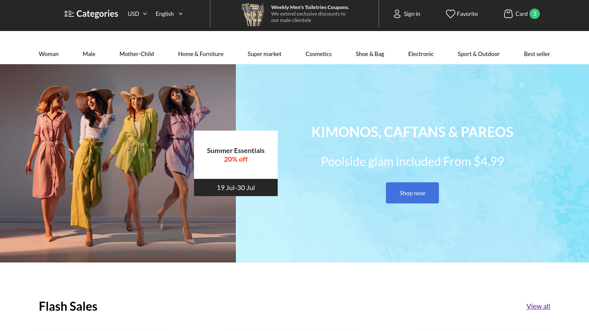

# eStore
It's a template for an electric store. Made using random design from Figma Community.

## Stack
* React
* React-router
* Lodash
* Rx.js
* TypeScript
* SASS
* Vite
* ESLint
* Marked

## Structure of project
* Project made using hard structure that would be better to use for great team, not alone like me.

* Instead of REM uses pixels. But it as default ok.

## There is also BackEnd
Backend written using:
* Nest.js( underhoodly Express.js )
* TypeScript
* Prisma
* PostgreSQL
* Zod
* JWT/Bcrypt

### Structure of BackEnd
* PostgreSQL and Prisma, Postgres has a arrays and other structures that make it easier.

* Why Nest.JS instead of just Express.js? - I think for this kind of projects(great projects) it's best.

* TypeScript by default, why not.

## DevOps
* Nginx
* Debian
* PM2
* Let's encrypt